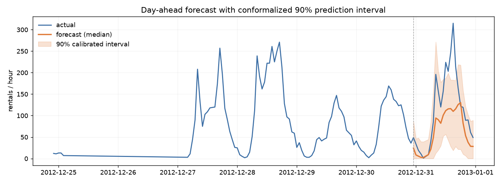

# surecast

**A day-ahead demand forecaster that tells you how confident it is - and why.** Calibrated prediction intervals (not just point forecasts) via conformalized quantile regression, SHAP explainability, honest rolling-origin backtesting, and a Streamlit dashboard. On real UCI bike-share data.

> Most forecasting portfolios stop at "model.fit()" and a line chart. This one quantifies uncertainty and validates that the uncertainty is calibrated, explains every prediction, and is ruthless about the one thing that quietly ruins time-series ML: data leakage.

## Results

All numbers below come from "artifacts/metrics.json", produced by "surecast backtest" (5-fold expanding-window rolling-origin CV over 15,439 hourly samples). Nothing here is hand-typed.

| model | MAE | RMSE | sMAPE | 90% coverage | interval width |
|---|---|---|---|---|---|
| SeasonalNaive (baseline) | 55.71 | 94.91 | 34.97% | - | - |
| GBM (gradient boosting) | **42.67** | **67.41** | **31.02%** | - | - |
| Conformal (CQR) | 49.04 | 78.46 | 32.07